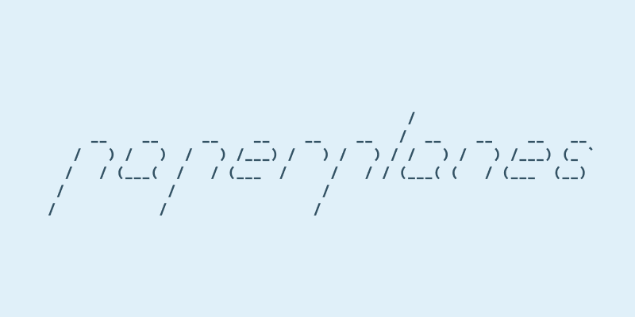

# _paperplanes.nvim_

 

Post selections or buffers to online paste bins. Save the URL to a register, or don't.

## Requirements

- Neovim 0.11+ (may work with older versions).
- A `curl` executable in your `$PATH`

## Install

Use your package manager.

## Setup

```lua
-- options shown with default values
require("paperplanes").setup({
  register = "+",
  provider = "0x0.st",
  provider_options = {},
  notifier = vim.notify or print,
  save_history = true
})
```

If you are satisfied with the defaults, you do not need to call `setup`.

- `register` - Any valid register name (`+`, `a`) or `false` to disable.
- `provider` - See supported provider below.
- `provider_options` - Options passed to the configured provider. See list of providers for accepted options.
- `notifier` - Any function that accepts a string for display. Defaults to vim.notify or print.
- `save_history` - Record actions to log file when `true`.

## Commands

### Basic usage

The `:PP` command posts the current buffer or visual selection to the configured
pastebin provider. It also supports additional actions like updating or
deleting pastes, depending on provider capabilities.

Create a paste of the entire current buffer:

```vim
:PP
```

Create a paste of the current visual selection:

```vim
:'<,'>PP
```

(Select text in visual mode `v`/`V` and press `:` to enter this form.)

> The `:PP` command will only be created if there is no existing `:PP` command.
> The `:Paperplanes` command may also be used.

### Advanced Usage

```vim
:PP [@<provider>] [action] [key=value ...]
```

- `@<provider>`: (optional) Override the default provider.
  - See tab-completion for known providers, ex: `@0x0.st`.
- `action`:
  - `create`: (default) Create a paste using the content of the current buffer or visual selection.
  - `update`: Update a paste using the content of the current buffer or visual selection.
    - Not all providers support updating, use tab-completion for available actions.
    - Updating pastes is only possible to do from the same instance of neovim
      that created the paste.
  - `delete`: Delete a paste associated with the current buffer.
    - Not all providers support deletion, use tab-completion for available actions.
    - Deleting pastes is only possible to do from the same instance of neovim
      that created the paste. You may review the history file
      (at `require("paperplanes").history_path()`) for tokens required to manually
      delete an historic paste from a provider.
- `key=value`: (optional) Supply arguments to a provider.
  - You must provide an action when supplying arguments.
  - See tab-completion for known arguments, though any given will be passed on
    to the best of paperplanes' ability, see your providers documentation.
  - You may also override default `provider_options`.


## Providers

_paperplanes_ supports the following providers, see sites for TOS and
features. _paperplanes_ is not affiliated with any provider in any manner.

- https://0x0.st (`provider = "0x0.st"`)
  - `expires`: hours or unix-epoch.
  - `secret`: generate longer urls.
- https://paste.rs (`provider = "paste.rs"`)
- https://paste.sr.ht (`provider = "sr.ht"`)
  - You **must** have the sourcehut cli (`hut`) installed and authenticated to use `paste.sr.ht`.
- https://gist.github.com (`provider = "gist"`)
  - `token`: Github Personal Access Token (PAT)
    - If the Github CLI tool (`gh`) is installed, a token will be automatically
      retrieved, otherwise you may specify the token as a string, or a function
      that returns a string.
    - The token must have "Read and Write" Gist access.
- https://dpaste.org (`provider = "dpaste.org"`)
- https://ray.so (`provider = "ray.so"`)
  - `padding`
  - `colors`
  - `darkmode`
  - `background`
  - See ray.so for values.
- https://mystb.in (`provider = "mystb.in"`)
  - `secret`: access protection password
- termbin.com
  - `command`: a `netcat` compatible command. Defaults to `nc`, `ncat` or
    `netcat` if no `command` is specified.
  - `host`: hostname of a self-hosted instance of `fiche`. Defaults to
    `termbin.com` if not specified.
  - `port`: port of self-hosted instance of `fiche`. Defaults to `9999` if not specified.

## History

A record of all actions performed is stored in a JSON file, located at
`require("paperplanes").history_path()` for review or manual operations.

History can be disabled via the `save_history` option.

Note that the history file may contain potentially sensitive content such as
deletion tokens *returned* from some providers. Authorization tokens (eg: Github
PATs) are never stored.

## API

The module `paperplanes` exposes the following functions for custom integration:

`create(source-id, content-string, content-metadata, on-complete, provider-name, provider-options)`

`update(source-id, content-string, content-metadata, on-complete, provider-name, provider-options)`

`delete(source-id, on-complete, provider-name, provider-options)`

- `source-id`: Any string or number value used to indentify a paste source. The
`PP` command uses the buffer-id for example. The same `source-id` should be passed when performing `update` or `delete` operations. Note that the value must only be unique per Neovim instance.

- `content-string`: A string of paste content.

- `content-metadata`: A table with the optional keys `path`, `filename`, `extension` and `filetype`. Values should be strings.

- `on-complete`: A function that receives `url` on success, or `nil, err` on an error.

- `provider-name`: (optional) See providers list, if not given the default `provider` is used.

- `provider-options`: (optional) See `provider_options` configuration. If not given and the `provider-name` matches the default configured `provider`, the default `provider_options` are used, otherwise no options are used.

## Building

Building _paperplanes_ requires [hotpot.nvim](https://github.com/rktjmp/hotpot.nvim) v0.9.7+.

The relevant `lua/` files should be built when saving any file inside `fnl/`.

## Changelog

See `CHANGELOG.md`.
